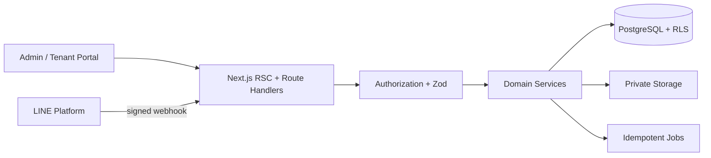

# Architecture

ระบบเป็น modular monolith บน Next.js: App Router/Route Handlers เรียก application services ซึ่งเรียก repositories/Supabase; business rule อยู่ใน `src/features` และไม่อยู่ใน React component งาน approve payment ต้องทำใน PostgreSQL transaction/function พร้อม idempotency key และเขียน ledger แบบ append-only

Server-only secret ไม่ถูกส่งเข้า client bundle การแยก organization ทำทั้ง foreign key column, query scope และ RLS; tenant access ผูก `auth.uid()` กับ `tenants.profile_id`
