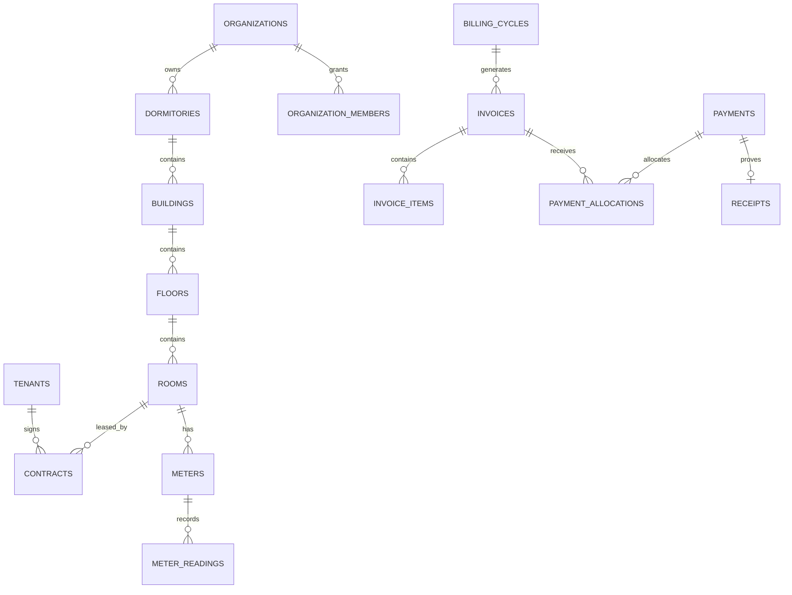

# Database

Migration แรกสร้างแกนองค์กร/หอพัก/ห้อง/ผู้เช่า/สัญญา/มิเตอร์/บิล/ชำระ/ledger/LINE/audit โดยห้าม cascade delete ข้อมูลการเงิน

Invariant สำคัญ: active contract ต่อห้องเป็น partial unique index, invoice ต่อรอบ/ห้อง/revision ไม่ซ้ำ, document/payment idempotency ไม่ซ้ำ, เงินเป็น `numeric(14,2)`, readings เป็น `numeric(16,3)` และ audit/ledger เป็น append-only ใน UI
